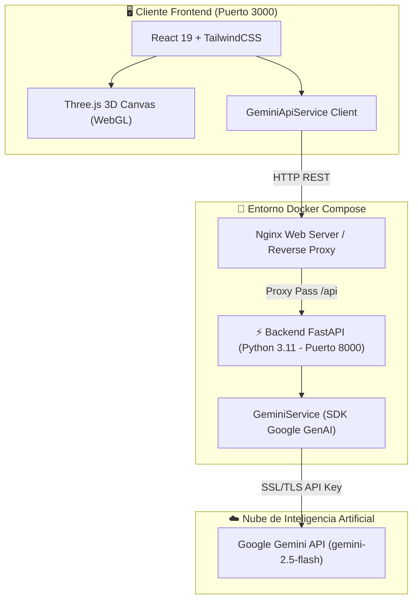

<div align="center">

# ⛏️ MINESAFE 3D
### Gemelo Digital Explicable (XAI) para Seguridad Minera en Tajo Abierto

[](https://www.docker.com/)
[](https://fastapi.tiangolo.com/)
[](https://ai.google.dev/)
[](https://react.dev/)
[](https://threejs.org/)
[](https://www.typescriptlang.org/)
[](https://opensource.org/licenses/MIT)

---

**Plataforma de Gemelo Digital 3D en Tiempo Real e Inteligencia Artificial Explicable (XAI) diseñada para la predicción, evaluación de atribución causal y prevención proactiva de colisiones en operaciones de minería a tajo abierto con flota mixta.**

[Visión General](#-visión-general) • [Arquitectura](#-arquitectura-del-sistema) • [Despliegue Docker](#-despliegue-con-docker) • [API FastAPI + Gemini](#-api-rest--motor-gemini) • [Modelos XAI](#-modelo-de-explicabilidad-xai--shap) • [RBAC](#-control-de-acceso-rbac)

</div>

---

> [!IMPORTANT]
> **Anticipación Predictiva Superior (H1)**: A diferencia de los sistemas de detección de proximidad (PDS) reactivos tradicionales (tiempo de aviso de 1.8 segundos), MineSafe 3D procesa la telemetría biológica (fatiga PERCLOS), mapas de visibilidad LiDAR y cinemática vehicular para emitir alertas críticas con **6.4 segundos de anticipación promedio**, logrando una efectividad del **100% en cuasi-colisiones mitigadas**.

---

## 📌 Visión General

**MineSafe 3D** combina la potencia de la aceleración gráfica WebGL en el navegador con la capacidad cognitiva del motor **Google Gemini API** orquestado sobre un backend industrial en **FastAPI**.

### 🌟 Métricas de Desempeño Operativo

| Métrica de Desempeño | Gemelo Digital (IA Multi-Modal) | Sistema PDS Estándar | Delta de Mejora |
| :--- | :--- | :--- | :--- |
| **Tiempo de Anticipación (H1)** | **6.4 segundos** antes del evento | 1.8 segundos (Reactivo) | **+4.6 seg (+255%)** |
| **Área bajo la Curva (AUC-ROC)** | **0.942** (Excelente discriminación) | 0.710 (Moderado) | **+0.232** |
| **Tasa de Falsas Alarmas (FPR)** | **4.8%** de alertas descartadas | 24.2% (Fatiga por alarma) | **-80.1% reducción** |
| **Cuasi-Colisiones Mitigadas** | **100%** de eventos críticos prevenidos | N/D | **Máxima efectividad** |
| **Cumplimiento Ético / Consentimiento** | **100%** Operadores con firma digital | Sin trazabilidad | **Auditado MSHA** |

---

## 🛠️ Arquitectura del Sistema

El sistema sigue una arquitectura desacoplada y containerizada, optimizada para baja latencia y alta concurrencia:



---

## 📁 Estructura del Proyecto

```text
gemelo-digital-prototipo/
├── 📄 docker-compose.yml        # Orquestación de contenedores (Frontend + Backend)
├── 📄 Dockerfile                # Multi-stage build para React + Nginx
├── 📄 Dockerfile.dev            # Entorno de desarrollo para Vite
├── 📄 nginx.conf                # Configuración de Nginx para SPA
├── 📄 package.json              # Dependencias del Frontend React
├── 📄 tsconfig.json             # Configuración TypeScript
├── 📄 .env.example              # Plantilla de variables de entorno
├── 📁 .vscode/                  # Configuración de entorno e historial de terminal
│   └── settings.json
├── 📁 backend/                  # ⚡ Motor Backend FastAPI
│   ├── 📄 main.py               # Servidor FastAPI principal y middleware CORS
│   ├── 📄 config.py             # Gestión de variables de entorno
│   ├── 📄 requirements.txt      # Dependencias de Python
│   ├── 📄 Dockerfile            # Imagen Docker para el backend FastAPI
│   └── 📁 app/
│       ├── 📁 routers/          # Endpoints RESTful (/api/gemini)
│       └── 📁 services/         # Integración SDK Google Gemini
└── 📁 src/                      # 🎨 Aplicación Frontend React
    ├── 📄 App.tsx               # Dashboard principal e integrador del Gemelo 3D
    ├── 📁 components/           # Componentes modulares
    │   ├── 📁 3d/               # Visor WebGL 3D del tajo abierto
    │   ├── 📁 alerts/           # Centro de alertas de colisión
    │   ├── 📁 dashboard/        # Gráficos y analítica operacional
    │   ├── 📁 docs/             # Documentación de arquitectura
    │   ├── 📁 ethics/           # Módulo de consentimiento ético
    │   ├── 📁 rbac/             # Gestión de roles e historial de auditoría
    │   ├── 📁 reports/          # Generador de reportes PDF/Excel
    │   ├── 📁 scenarios/        # Inyector de escenarios de riesgo
    │   └── 📁 xai/              # Paneles SHAP y Asistente Gemini AI
    ├── 📁 services/             # Clientes de API y motores de cálculo
    │   ├── 📄 geminiApi.ts      # Cliente HTTP para el backend FastAPI
    │   ├── 📄 reportGenerator.ts# Exportador técnico en PDF
    │   └── 📄 riskEngine.ts     # Cálculo cinemático de colisiones
    └── 📁 types/                # Definiciones de tipos TypeScript
```

---

## 🚀 Despliegue con Docker

### Paso 1: Clonar el Repositorio
```bash
git clone https://github.com/Prolexis/gemelo-digital-prototipo.git
cd gemelo-digital-prototipo
```

### Paso 2: Configurar Variables de Entorno
Crea un archivo `.env` en la raíz del proyecto basado en `.env.example`:

```env
# Clave de API oficial de Google Gemini
GEMINI_API_KEY="TU_GEMINI_API_KEY_AQUI"

# Modelo de Gemini preferido
GEMINI_MODEL="gemini-2.5-flash"

# URL base de la API para el cliente React
VITE_API_URL="http://localhost:8000"
```

### Paso 3: Construir e Iniciar Contenedores
```bash
docker compose up -d --build
```

### Paso 4: Verificar Estado
```bash
docker compose ps
```

> [!TIP]
> Accede a **[http://localhost:3000](http://localhost:3000)** para ver el Gemelo Digital 3D en funcionamiento y a **[http://localhost:8000/docs](http://localhost:8000/docs)** para explorar la documentación interactiva Swagger de la API.

---

## 📡 API REST & Motor Gemini

El backend expone servicios especializados bajo la ruta `/api/gemini`:

### 1. `GET /api/gemini/health`
Verifica la disponibilidad del motor FastAPI y la conexión con el SDK de Gemini.

**Respuesta de ejemplo:**
```json
{
  "status": "online",
  "gemini_api_key_configured": true,
  "key_snippet": "...56D50C",
  "model": "gemini-2.5-flash",
  "engine": "FastAPI + Google Gemini API",
  "client_sdk": "google-genai"
}
```

### 2. `POST /api/gemini/analyze-risk`
Procesa la telemetría de un equipo, la severidad de la alerta y los factores de atribución SHAP para generar un diagnóstico XAI.

**Ejemplo de Request (cURL):**
```bash
curl -X POST http://localhost:8000/api/gemini/analyze-risk \
  -H "Content-Type: application/json" \
  -d '{
    "equipment_id": "eq-ht-104",
    "alert_data": {
      "severity": "CRITICAL",
      "time_to_collision": 6.2,
      "zone": "RAMPA_ESTE_SECTOR_4"
    },
    "shap_factors": [
      {"feature": "Fatiga Biológica (PERCLOS)", "impact": 0.42},
      {"feature": "Punto Ciego Ángulo Muerto", "impact": 0.28}
    ]
  }'
```

### 3. `POST /api/gemini/chat`
Asistente interactivo en tiempo real integrado en la interfaz gráfica mediante modal conversacional.

---

## 🧠 Modelo de Explicabilidad (XAI) & SHAP

MineSafe 3D implementa **TreeSHAP (SHapley Additive exPlanations)** para descomponer las predicciones del modelo en factores humanos, ambientales y cinemáticos:

$$\text{Riesgo Total} = \phi_0 + \sum_{i=1}^{M} \phi_i$$

Donde $\phi_i$ representa la contribución de cada variable:
- **$\phi_{\text{PERCLOS}}$**: Porcentaje de cierre ocular del operador (medida biológica de somnolencia).
- **$\phi_{\text{Ángulo Muerto}}$**: Oclusión visual causada por la geometría del camión de extracción (CAT 797F / Komatsu 930E).
- **$\phi_{\text{Velocidad}}$**: Exceso de velocidad respecto al límite de diseño del tajo.
- **$\phi_{\text{Visibilidad}}$**: Reducción de visibilidad por tormentas de polvo o niebla.

---

## 🔐 Control de Acceso (RBAC)

El sistema incorpora un modelo de control de acceso basado en roles con trazabilidad inmutable de auditoría:

| Rol | Gemelo 3D | Inyector de Escenarios | Reconocer Alertas | Generar Reportes PDF | Consentimiento Ético |
| :--- | :---: | :---: | :---: | :---: | :---: |
| **Supervisor HSE** | ✅ | ✅ | ✅ | ✅ | ✅ |
| **Administrador** | ✅ | ✅ | ✅ | ✅ | ✅ |
| **Operador** | ✅ | ❌ | ✅ | ❌ | 👁️ (Lectura) |
| **Data Scientist** | ✅ | ✅ | ❌ | ✅ | ❌ |
| **Auditor MSHA** | ✅ | ❌ | ❌ | ✅ | ✅ |

---

## 📄 Licencia

Este proyecto está bajo la Licencia **MIT**. Consulta el archivo `LICENSE` para obtener más información.

<div align="center">
  <sub>Desarrollado para el Gemelo Digital de Seguridad Minera en Tajo Abierto. © 2026 Prolexis Mining Systems.</sub>
</div>
